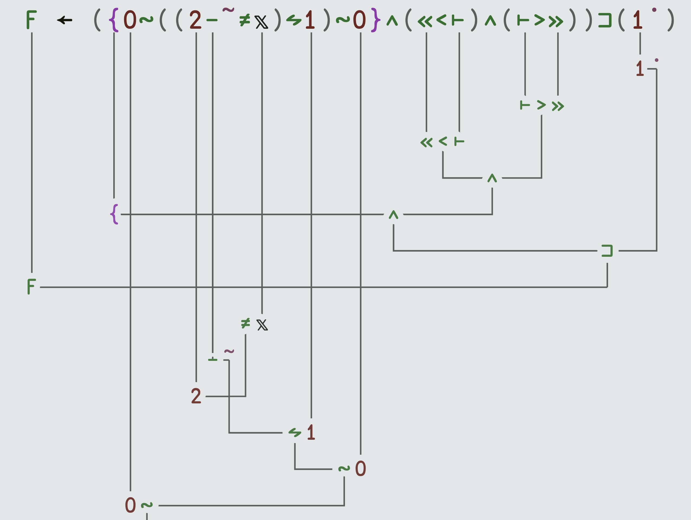

## Leetcode Problem in the Most Popular Programming Languages of 1965

Today we'll be solving a leetcode problem in the most popular programming languages of the year 1965!

Most of these langauges have changed so so much since 1965, so the way I'm using these languages won't be *exactly* the same as they were used back then.
For example, I couldn't find a way to compile and/or run an ALGOL50 program, so I'll have to use Algol68, a later standard of the language.
Similarly, the first APLs were intended for use on a blackboard, and the first actual implementations were all proprietary.
For the most part, I made some attempt to use an older version of each language to get a better feel for what it would be like to use the langauge back in the day.

I'll be looking at the languages in ascending order based on their popularity in 1965.

Along with my solution for each language, I'll give a little bit of history.

## Problem

Find the peak element that is greater than both neighbors.
[link](https://leetcode.com/problems/find-peak-element/)

## Content

1. [APL](#apl)
1. [Lisp](#lisp)
1. [BASIC](#basic)
1. [ALGOL](#algol)
1. [COBOL](#cobol)
1. [Fortran](#fortran)

### [APL](#content)

APL was originally designed by Ken Iverson in 1957 as a mathematical notation to be used on blackboards[[ref](#ref-hist-apl-computer-history)].

Kev Iverson was hired by IBM in 1960 to further develop the notation, at that point still just a mathematical notation and not a programming language.

Finally in 1966 the IBM released APL360 written in a bit under 40,000 lines of 360 assembly, called APL after Iverson's famous paper *A Programming Language*.

It was at this time that some of my colleagues at Pacific Northwest National Laboratory first tried APL on the IBM mainframes, and when Richard Stallman wrote a text editor in APL [[ref](#ref-gnuapl-stallman)].

Just before leaving IBM, in 1979 Iverson gave his famous *ACM Turing Award Lecture* titled *Notation as a tool of Thought* where he builds up algorithm intuition in the reader using the APL language[[ref](#ref-ntot)].

In 1980, Iverson left IBM for I. P. Sharp Associates where he developed SHARP APL [[ref](#ref-wiki-iverson)].

It was just after this in 1981 that Dyalog APL was born, potentially the most popular APL implementation today and a significant force in the APL community[[ref](#ref-hist-dyalog)].

Ken Iverson moved on from IPSharp in 1990 to JSoftware to write the J programming language along with Roger Hui, a colleague from I.P. SHARP, who sadly passed away earlier this month in October 2021.

I used the BQN language as my APL of choice, as it's very actively developed and I believe in the developers behind the project.

APL solution:
```
i0 ← 1‿2‿3‿1
i1 ← 1‿2‿1‿3‿5‿6‿4
i2 ← 2‿1‿2‿3‿1
F ← ({0∾((2-˜≠𝕩)⥊1)∾0}∧(«<⊢)∧(⊢>»))⊐(1˙)
F ¨ i0‿i1‿i2
```

<center>

</center>

### [Lisp](#content)

I used MIT Scheme for my Lisp since it seems like the oldest lisp implementation that I can still install.

```scheme
(define zshl
  (lambda (l)
    (reverse (cons -1 (reverse (cdr l))))
    ))

(define zshr
  (lambda (l)
    (cons -1 (reverse (cdr (reverse l))))
    ))

(define solve
  (lambda (input)
    (reduce max 0
            (map
              (lambda (a b)
                (if a b -1))
              (map >
                   input
                   (map max
                        (zshl input)
                        (zshr input)))
              (iota (length input))))))

(for-each
  (lambda (l)
    (newline)
    (display (solve l))
    (newline))
  (list
    '(1 2 3 1)
    '(1 2 1 3 5 6 4)
    '(2 1 2 3 2 1)))
```

### [BASIC](#content)

I used FreeBASIC for this example.
```basic
         dim i0(1 to 4) as integer ''{ 1, 2, 3, 1 }
         i0(1) = 1
         i0(2) = 2
         i0(3) = 3
         i0(4) = 1

         dim i1(1 to 7) as integer
         i1(1) = 1
         i1(2) = 2
         i1(3) = 1
         i1(4) = 3
         i1(5) = 5
         i1(6) = 6
         i1(7) = 4

         function solve(prob() as Integer) as Integer
             for i as integer = lbound(prob)+1 to ubound(prob)-1
                 if (prob(i)>prob(i+1) and prob(i)>prob(i-1)) then solve=i-1
             next
         end function

         print solve(i0())
         print solve(i1())
```

### [ALGOL](#content)

I'm using the Algol68 Genie compiler-interpreter for this code.

```algol
PROC solve = ([]INT elements)INT: (
  INT found := -1;
  FOR i FROM 1+(LWB elements) TO (UPB elements)-1
  DO
    IF elements[i] > elements[i+1] AND elements[i] > elements[i-1]
      THEN
        found := i-1
      FI
  OD;
  found 
);
```

### [COBOL](#content)

I use the GNUCobol compiler for this example.

```cobol
       ID DIVISION.
       PROGRAM-ID. ARRAYTEST.
       ENVIRONMENT DIVISION.
       DATA DIVISION. 
       WORKING-STORAGE SECTION.
      * Store both problems and their sizes and answers in one
      * structure
       01 SIZES PIC 9(3) OCCURS 2 TIMES VALUE 0.
       01 OFFSETS PIC 9(3) OCCURS 2 TIMES VALUE 0.
       01 PROBLEMS PIC 9(3) OCCURS 12 TIMES VALUE 0.
       01 CURRENT-PROBLEM PIC 9(3) VALUE 0.
       01 TMP PIC 9(3) VALUE 0.
       01 IDX PIC 9(3) VALUE 1.
       01 NPROBLEMS PIC 9(3) VALUE 2.
       01 ANSWERS PIC S9(3) OCCURS 2 TIMES VALUE -1.
       PROCEDURE DIVISION.

       100-MAIN.

      *    Set up problem [1,2,3,1]
           MOVE 4 TO SIZES(1).
           MOVE 0 TO OFFSETS(1).

           MOVE 1 TO PROBLEMS(1).
           MOVE 2 TO PROBLEMS(2).
           MOVE 3 TO PROBLEMS(3).
           MOVE 1 TO PROBLEMS(4).

      *    Set up problem [1,2,1,3,5,6,4]
           MOVE 7 TO SIZES(2).
           MOVE 4 TO OFFSETS(2).

           MOVE 1 TO PROBLEMS(5).
           MOVE 2 TO PROBLEMS(6).
           MOVE 1 TO PROBLEMS(7).
           MOVE 3 TO PROBLEMS(8).
           MOVE 5 TO PROBLEMS(9).
           MOVE 6 TO PROBLEMS(10).
           MOVE 4 TO PROBLEMS(11).

      *    Run solve procedure on both problems
           PERFORM VARYING CURRENT-PROBLEM FROM 1 BY 1 UNTIL CURRENT-PRO
      -BLEM > NPROBLEMS
             MOVE OFFSETS(CURRENT-PROBLEM) TO IDX
             PERFORM SOLVE
             DISPLAY ANSWERS(CURRENT-PROBLEM) END-DISPLAY
           END-PERFORM.

           STOP RUN.

       SOLVE.
           PERFORM VARYING IDX FROM 2 BY 1 UNTIL IDX>SIZES(CURRENT-PROBL
      -EM)
             COMPUTE TMP = IDX + OFFSETS(CURRENT-PROBLEM) END-COMPUTE
             IF PROBLEMS(TMP) > PROBLEMS(TMP - 1)
      -AND PROBLEMS(TMP) > PROBLEMS(TMP + 1)
               COMPUTE TMP = IDX - 1 END-COMPUTE
               MOVE TMP TO ANSWERS(CURRENT-PROBLEM)
             END-IF
           END-PERFORM.

       PRINT-AR.
           DISPLAY "IDX=" IDX " VALUE=" PROBLEMS(IDX) END-DISPLAY.
```

### [Fortran](#content)

I used the GNU gfortran compiler in fixed-form F77 mode for this.

```fortran
c     Comments require a 'c'in the first column
      program main
        integer :: ret
        integer, dimension(4) :: i0 = (/1, 2, 3, 1/)
        integer, dimension(7) :: i1 = (/1,2,1,3,5,6,4/)
        ret = -1
        call solve(i0, size(i0), ret)
        print*,ret
        call solve(i1, size(i1), ret)
        print*,ret
      end program

      subroutine solve(input, len, ret)
        integer, intent(in) :: len
        integer, intent(out) :: ret
        integer, dimension(len) :: input

        integer :: i

        do i = 2, (len-1)
          if (input(i) > input(i+1) .and. input(i) > input(i-1)) then
            ret = i-1
            return
          endif
        enddo
      end subroutine
```

The name "Fortran" is derived from [FORmula TRANslation](#ref-ftn-start).

## References

* <a name="ref-ftn-start">[Fortran history](https://en.wikipedia.org/wiki/Fortran#History)</a>
* <a name="ref-pop-langs">[Most Popular Programming Languages](https://statisticsanddata.org/most-popular-programming-languages/)</a>
* <a name="ref-hist-apl-computer-history">[The Apl Programming Language Source Code](https://computerhistory.org/blog/the-apl-programming-language-source-code/)</a>
* <a name="ref-wiki-iverson">[Kenneth Iverson Wikipedia](https://en.wikipedia.org/wiki/Kenneth_E._Iverson)</a>
<a name="ref-ntot"></a>[*Notation as a Tool of Thought*, Ken Iverson](https://www.jsoftware.com/papers/tot.htm)
* <a name="ref-hist-dyalog">[History of Dyalog](https://www.dyalog.com/uploads/files/apl50/Dyalog%20APL%20A%20Personal%20History.pdf)</a>
* <a name="ref-gnuapl-stallman" href="https://en.wikipedia.org/wiki/APL_(programming_language)#GNU_APL">GNU APL</a></a>
* <a name="ref-pnnl"><a href="https://www.pnnl.gov/">Pacific Northwest National Laboratory</a></a>
